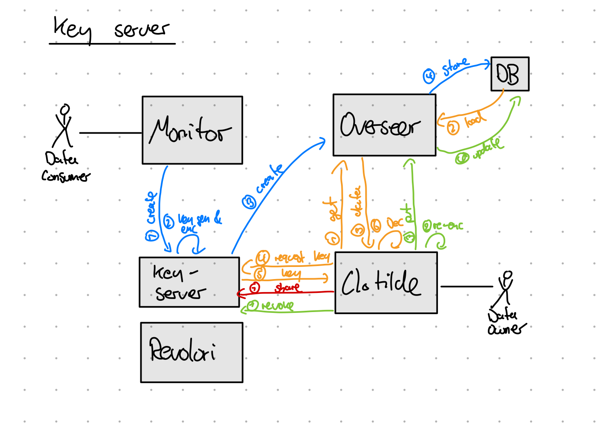
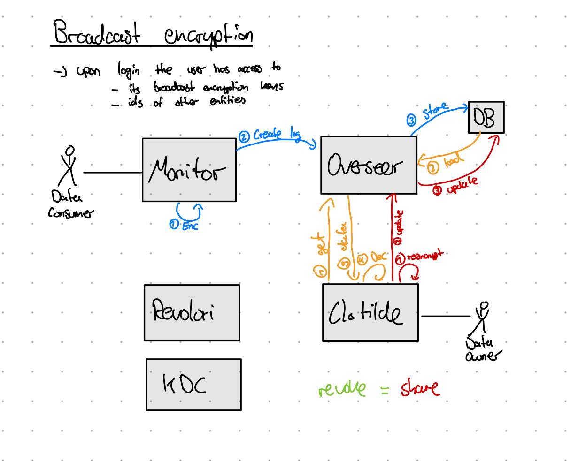
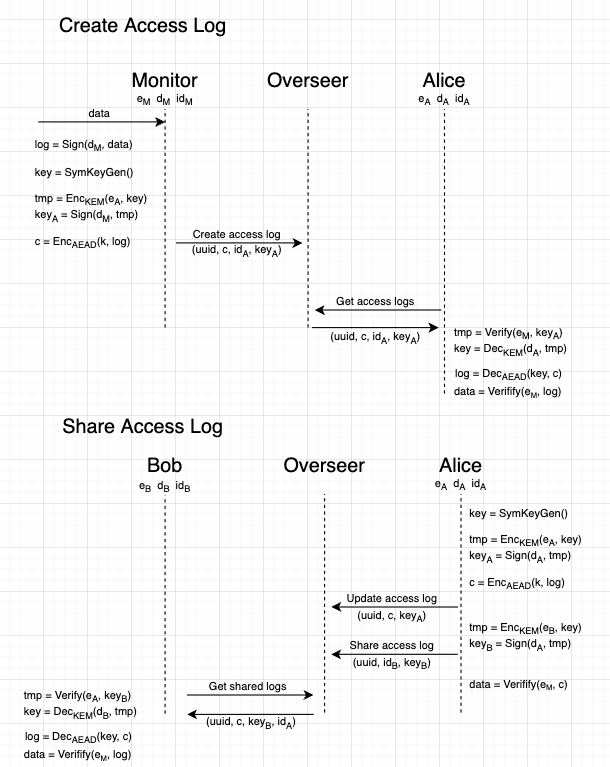

0. Abstract
1. Introduction (3)
    - Current architecture
    - Implications and problems
2. Terms and Definitions (3)
3. Requirements (5)
    - Functional requirements
    - Security requirements
    - Non-functional requirements
4. Overview of potential solutions (10)
    - External encryption (1)
    - Mutual encryption (1)
    - Key server (1)
    - Broadcast encryption (3)
    - Hybrid encryption (2)
    - Further investigations (2)
5. Approach (9)
    - Reasoning for approach (1)
    - Protocol (4)
      - JOSE
      - Encryption
      - Decryption
    - Implemented Libraries (4)
      - Overview/Architecture
      - Ts-It-Crypto
      - Py-It-Crypto
      - Go-It-Crypto
6. Evaluation (5)
    - Functionality (1)
    - Security (4)
      - General considerations
      - Curious server
      - Surreptitious forwarding
      - Malicious data owner
7. Conclusion (3)


# 0. Abstract

# 1. Introduction
    Describes the problem statement, illustrates why this is a problem and describes the contribution the thesis makes in solving this problem. Optionally, it can give a short description (1-3 sentences each) of the remaining chapters. Good introductions are concise, typically no longer than 4 pages.
    The introduction reveals the full (but summarized) results of your work

    Motivation for E2EE  here: https://eprint.iacr.org/2021/486.pdf


# 2. Terms and Definitions
    Defines the fundamental concepts your thesis builds on. Your thesis implements a new type of parser generator and uses the term non-terminal symbol a lot? Here is where you define what you mean by it. The key to this chapter is to keep it very, very short. Whenever you can, don’t reinvent a description for an established concept, but reference a text book or paper instead.

# 3. Requirements

Following: https://www.uni-due.de/imperia/md/content/swe/papers/2010a-comparison-of-security-requirements-engineering-methods.pdf


There are three major goals in the context of this thesis:

1. Encrypt log data, s.t. overseer can not access logs (E2E encryption, confidentiality -> security goal)  
   Defending against `honest-but-curions server`:
      - attacker follows protocol of overseer to store and load data
      - attacker attempts to analyze all legitimately received information (e.g. analyzes logs and policies stored in the database)
      - can collude with others (e.g. a malicious data owner)
      - passive attacker
      - similar to section 12.2 in https://sci-hub.ru/https://doi.org/10.1016/B978-0-12-805394-2.00012-X

2. Data owner needs to be able to share and revoke log data with others (-> functional goal)

3. Defend against a `malicious data owner` (integrity -> security goal):
      - attacker does not follow the protocol and tries to manipulate data logs (integrity and authenticity)
      - attacker tries to share manipulated logs with others (e.g. because attacker wants to discredit others)
      - active attacker
      - similar to section 3.1 https://mediatum.ub.tum.de/doc/1615228/7emnvw4k3nyma9pbthb37cnc4.ease2021-29.pdf


## 3.1 Functional Requirements

    what the system does (p.11)


1. Define stakeholder goals

Already Implemented:
  - logs are created upon accessing private data
  - data owner can access their logs
  - data owner can restrict data consumers from accessing their private data

This thesis:
  - data owner wants to share logs with others
  - data owner wants to revoke access to logs

2. Goals into stakeholder requirements
  - Once a log was created, only the owner can access the content of the log
  - The owner of a log can share the logs with other users within the system, s.t. after sharing a defined set of users can access the logs
  - The owner of a log can revoke the access to the logs, s.t. after revocation only the defined set of users can access the logs
3. Stakeholder requirements into functional system requirements


## 3.2 Non-Functional Requirements

    global requirements on its development or operational costs, performance, reliability, maintainability, portability, robustness and the like (p.11)

1. Define stakeholder goals
2. Goals into stakeholder requirements
3. Stakeholder requirements into non-functional system requirements

- Trust
    - Avoid trusted entities -> Do not introduce additional trusted entities

- Maintainability
    - Simplicity of design -> ?
    - Documentation -> Create a documentation of the implemented features

- Portability (e.g. to new platforms, languages, ...)
    - Standardized algorithms -> do not user crypto algorithms with are not recommended (https://www.bsi.bund.de/SharedDocs/Downloads/EN/BSI/Publications/TechGuidelines/TG02102/BSI-TR-02102-1.pdf?__blob=publicationFile&v=10) and which are not part of WebCrypto API (https://developer.mozilla.org/en-US/docs/Web/API/SubtleCrypto)
  
- Availability 
    - shared data is available even if the sharing user is not online -> ?

- Usability

    "Usability requirements cannot be directed verified, since they involve subjective behaviors that often have to be collected over time." (https://www.sciencedirect.com/topics/computer-science/usability-requirement)
    Usually we have a trade-off between Security and Usability. In this context the complexity of security is a key-driver to improve usability. By integrating the error-prone cryptography tasks into the application we can increase the usability and thus the acceptance of the toolchain. However, this comes with the cost of increased design and implementation effort.

    - Avoid complexity -> stick to "principle of least effort" and decrease the amount of clicks

      "The “principle of least effort “essentially states that people will do the least amount of work to get something done. This can apply to the amount of thought, time, energy or even key strokes- at the end of the day every human prefers the path of least resistance." (https://dzone.com/articles/the-principle-of-least-effort-an-integral-part-of)

    - Visualization -> UI for shared data, just as for own logs

- Performance
    - Minimize resource utilization -> avoid redundant data within the database


  
## 3.3 Security Requirements

    We consider security requirements to be a part of the non-functional-requirements (p.11)

1. Define stakeholder security goals ("security concerns towards an asset")
  - CIA triad
  - "too vague to be be verifiable"
  - Example: "For example, the customers of a bank may have the
confidentiality goal that their financial situation remains
confidential"
2. Define security requirements ("concretize security goals")
  - information
  - counter-stakeholder
  - circumstances
  - Example: "In the banking example, a customer’s security requirement states that the exact balance of his or her account
must not become known to arbitrary bank employees or
other customers. Here, the information is the account balance, and the counter-stakeholders are bank employees and
other customers. The circumstances describe, e.g., that an
authorized bank employee who needs to know the balance
for a specific purpose may nevertheless get to know it, or
that the balance must be kept confidential for at least
50 years after the account has been closed"

1. Goals
  - Logs are E2E encrypted (confidentiality+authenticity)
    E2EE (https://eprint.iacr.org/2022/449.pdf): "Unlike standard notions of encryption, we require
that protocols and systems claiming “endness’ must be explicit about what
endpoints are within any particular application, and how users can verify that they are in fact engaging with the appropriate endpoint."

    Good source: https://www.ietf.org/id/draft-knodel-e2ee-definition-05.html#name-end-to-end-principle
  - Logs are integrity protected by the issuer (integrity)

2. Requirements
  - Logs are E2E encrypted (https://en.wikipedia.org/wiki/End-to-end_encryption)
    - information: The content of the logs can only be known by communicating users (encryption endpoints). Encryption endpoints: Monitor and data owner if logs are not shared. Data owner and shared entity if logs are shared. Moreover E2E requires authenticated encryption, because otherwise a third party could inject malicious data (https://eprint.iacr.org/2022/449.pdf)
    - counter-stakeholder: honest-but-curious overseer, 
    - circumstances: sharing of logs -> dynamic encryption endpoints
-  Logs are integrity protected (integrity)
    - information: decrypted log files can not be modified by the owner or by a shared user
    - counter-stakeholder: malicious data owner
    - circumstances: monitor is allowed to initially create logs (-> needs to be trusted because the monitor could potentially create malicious logs)

## 3.4 Consistent System Requirements

1. collect all functional and non-functional requirements
2. resolve conflicts between them to obtain consistent system requirements 


# 4. Overview of potential solutions
    For me this is chapter is similar to Related Work

    Collects descriptions of existing work that is related to your work. Related, in this sense, means aims to solve the same problem or uses the same approach to solve a different problem. This chapter typically reads like a structured list. Each list item summarizes a piece of work (typically a research paper) briefly and explains the relation to your work. This last part is absolutely crucial: the reader should not have to figure out the relation himself. Is your piece better from some perspective? More generalizable? More performant? Simpler? It is ok if it is not, but I want you to tell me.

**Assumption:**
We have an established public key environment by the following means:
1. Each user is equipped with a public key pair and its identity. Thus, the user has access to its public key and its private key (e.g. via smartcard).
2. The trusted Revolori server can map the user identity to its public key. This ensures, that the Revolori can issue certificates (signed data structures attesting that this identity has access to the private key belonging to this public key). There is no difference in terms of security, if the Revolori server computes the public key pair and distributes it to the user or if the Revolori verifies, that a user owns the private key to its claimed pulbic key (Challenge-Response)
  - Revolori computes and distributes keys: If compromised, attacker can impersonate any user -> authenticity broken
  - Revolori verifies claimed keys: In this case the Revolori server issues certificates (signed data structures) which verifies that a given identity owns the private key to the stated public key. If compromised, attacker can issue any certificate and can thus impersonate any user -> authenticity broken
  - Without Revolori server: 
    - CR needs to be performed each time a public key is presented. This especially means, that the sender and the receiver of the message need to be online -> impractical
    - Users need to verify fingerprints of public key
    - Trust on first use -> does not make a lot of sense in enterprise context


Goal S2. can be satisfied by signing the created access log. Upon decryption, each user should verify if the log was encrypted by the monitor

**Easy solution:**  
Each entity has a public-key pair.  Each data log is encrypted with the public key, s.t. only data owner can decrypt (resolves goal 1). Goal 2 can be solved by encrypting signed data. After each decryption this signed data need to be verified.

**Problems:**
1. How could data be shared, e.g. how to resolve goal 2 if data logs can only be decrypted by the data owner?
2. How can encrypted data be stored/queried on the server?

## 4.1 External Encryption
Encrypt data log with public key of target and send externally (e.g. via email)

- Functional Goals
  - ✅ F1. Create Access Logs
  - ✅ F2. Share Access Logs
  - ❌ F3. Revoke Access Logs
- Security Goals
  - ❌ S1. Access logs are E2EE
  - ✅ S2. Access logs are integrity protected
- Non-functional Goals
  - ✅ N1. Trusted Entities
  - ✅ N2. Standard Crypto
  - ❌ N3. Usability
  - ✅ N3. Simplicity of Design
  - ❌ N4. Resource utilization

## 4.2 Mutual Encryption
Data owner re-encrypts the log for the target. The re-encrypted data is sent back to overseer, which saves them in a "sharedLog" table
 
- Functional Goals
  - ✅ F1. Create Access Logs
  - ✅ F2. Share Access Logs
  - ✅ F3. Revoke Access Logs
- Security Goals
  - ✅ S1. Access logs are E2EE
  - ✅ S2. Access logs are integrity protected
- Non-functional Goals
  - ✅ N1. Trusted Entities
  - ✅ N2. Standard Crypto
  - ✅ N3. Usability
  - ✅ N3. Simplicity of Design
  - ❌ N4. Resource utilization (duplicated data + encryption of application data with RSA is not efficient)

## 4.3 Key-Server
Encrypt logs with unique symmetric key and store them in database. The symmetric key is stored on a trusted key server, which hands out the key to authorized users: After creation only the owner is allowed to access the key. The owner can add/revoke permissions of others to access the key.



- Functional Goals
  - ✅ F1. Create Access Logs
  - ✅ F2. Share Access Logs
  - ✅ F3. Revoke Access Logs
- Security Goals
  - ✅ S1. Access logs are E2EE
  - ✅ S2. Access logs are integrity protected
- Non-functional Goals
  - ❌ N1. Trusted Entities (key server needs to be trusted)
  - ✅ N2. Standard Crypto
  - ✅ N3. Usability
  - #️⃣ N3. Simplicity of Design (adds complexity to the protocol)
  - #️⃣ N4. Resource utilization (a lot of communication between clients and key server)

## 4.4 Broadcast-Encryption
Re-encrypt data by means of a broadcast encryption scheme. Only a defined set of users can decrypt the data.


- Functional Goals
  - ✅ F1. Create Access Logs
  - ✅ F2. Share Access Logs
  - ✅ F3. Revoke Access Logs
- Security Goals
  - ✅ S1. Access logs are E2EE
  - ✅ S2. Access logs are integrity protected
- Non-functional Goals
  - ❌ N1. Trusted Entities (KDC needs to be trusted, key escrow)
  - ❌ N2. Standard Crypto
  - ✅ N3. Usability
  - #️⃣ N3. Simplicity of Design (adds complexity)
  - ✅ N4. Resource utilization

### Assumptions
- Trusted CA for authenticated messages
- Trusted KDC, which distributes keys to user (IBBE, ABBE)
  - broken KDC: Attacker can decrypt everything, because he has arbitrary keys
  
### Challenges:  
- How to implement ABE in frontend? Critical part: implement bilinear pairing
  - C: https://crypto.stanford.edu/pbc/
  - Python: https://pypi.org/project/charm-crypto/ (using C lib under the hood -> not possible to use this via brython)
  Curve definitions: https://github.com/JHUISI/charm/blob/acb55513b244bfdebbfe715cec7b564c8e850779/charm/toolbox/pairingcurves.py
  - Rust: https://github.com/zcash-hackworks/bn
  - Rust (Fraunhofer): https://github.com/georgbramm/rabe-bn 
      - Rust (Fraunhofer): https://github.com/georgbramm/rabe-bn 
  - Rust (Fraunhofer): https://github.com/georgbramm/rabe-bn 
- use web assembly to implement bilinear pairing efficiently in browser:
  1. Follow the reference implementation (e.g. AC17 in python, which relies on pbc)
  2. Outsource heavy computation to wasm (pairing) or use existing library (need to be converted to WASM)
- Compile existing libraries (e.g. Rust ABE by Fraunhofer) into WASM, which allows their execution in JS
- Trust problem:
  - Proxy-based Re-Encryption: Server can re-encrypt all logs of a user once a re-encryption key was created
  - IBBE, ABBE: Trusted entity has access to a secret master key, which is used to compute secret keys of users. This enables key-escrow and is a problem for E2EE, because it introduces an additional encryption endpoint -> no E2EE in a very strict sense anymore (see https://jbasney.net/IWAP06IBE.ppt). Possible solution strategies: (https://link.springer.com/chapter/10.1007/978-1-4419-9383-0_11)
    - Distributed KDC
    - Certificate-based encryption (double encrypting)
    - Anonym IBE -> not practical in our setting, because the trusted entity maintains user information
  - CBBE: Resolves this problem, but where is this implemented?
- User revocation problem: How to handle users which leave the system?
  - ABE: 1) New set of keys of everyone 2) Maintain a list of left users which need to be requested to avoid encrypting data for them
    

## 4.5 Hybrid Encryption
Use public key pairs to encapsulate symmetric keys.
Initially only the data owner can access the log.

Upon sharing, the data owner:
1. creates a new symmetric key k
2. decrypts encapsulated key its private key
3. decrypts the access log with the resulting symmetric key
3. encrypts the data low with the symmetric key k
4. encrypts k with the public keys of each entity the log should be shared with (including certification checks)
5. updates the encrypted access log on the server
6. creates entries in the sharedLog table

Shared entities:
1. check if there are entries within the sharedLog table for them
2. decrypt the symmetric keys
3. access the encrypted access logs
4. decrypt the access logs

Upon revocation:
- can be understood as sharing with new set of users 


- Functional Goals
  - ✅ F1. Create Access Logs
  - ✅ F2. Share Access Logs
  - ✅ F3. Revoke Access Logs
- Security Goals
  - ✅ S1. Access logs are E2EE
  - ✅ S2. Access logs are integrity protected
- Non-functional Goals
  - ✅ N1. Trusted Entities
  - ✅ N2. Standard Crypto
  - ✅ N3. Usability
  - ✅ N3. Simplicity of Design
  - #️⃣ N4. Resource utilization

### Assumptions:
- CA which verifies that a public keys belong to certain identities
  - note, that this CA does not need to create key pairs on behalf of the users
  - however, the CA needs somehow to verify, that a user knows the corresponding secret key to a given public key
  - Malicious CA:
     - attacker can issue arbitrary certificates
     - public key might belong to the attacker instead to the expected user
     - attacker can also sign data on behalf of others
     - once the CA stats acting malicious, no data can be trusted anymore
     - However, since the CA does not know private keys, an attacker can not decrypt already encrypted logs

### Problems:
- malicious data owner can "destroy" logs, but is it interested in doing so?
- check whitepaper "broadcast" encryption to analyze efficiency of sharing/revocation
  - seems to be legitimate because both, signal and nextcloud, implement shared E2EE by pairwise channels (e.g. encrypting data for each user)
  - Signal Group Messaging (E2EE) https://signal.org/blog/private-groups/:
    - establishing pairwise sessions between all users within the group
    - broadcasting messages to each user on its own
- check revocation problem of users
  - Upon encrypting data with public key: check if this is valid (certificate revocation problem)
- overseer knows, which entity has access to which log
  - Revolori could maintain a list of pseudonyms

Advantages:
- free choice of symmetric scheme -> extension to improved encryption schemes which allow queries over ciphertexts


### JOSE

Considerations about used crypto in JOSE:
- "alg" Algorithm is responsible for encrypting symmetric CEK
  - ECDH versions require new ephemeral key each time (see 4.6 https://www.rfc-editor.org/rfc/rfc7518). This is used to create a fresh DH-secret, which will be used in a KDF to create a new symmetric key, which is again used to encrypt CEK. JOSE spec defines the One-Pass Diffie-Hellman algorithm (using one ephemeral EC key pair and one static EC key pair). Details: https://nvlpubs.nist.gov/nistpubs/SpecialPublications/NIST.SP.800-56Ar2.pdf (6.2.2.2)
  - RSA version allow to encrypt key without ephemeral keys, because dedicated key-wrapping functionality
  - Both ok, but using ECDH because better security with same key size


**Ideas regarding problem 2**
- if solving problem 1 with a dedicated crypto scheme, chances are high that this crypto scheme does not support queries over ciphertexts
- schemes that allow queries over encrypted data are currently researched (e.g. homomorphic encryption)
- Alternative: Keep a relational database
  - encrypt only logs (e.g. as a json)
  - save id of owner along with encrypted logs
  - save ids of shared owners with encrypted logs (1:n realtion)
  - improvement: provide pseudonyms for user ids, which are managed by revolori

# Approach
    Outlines the main thing your thesis does. Your thesis describes a novel algorithm for X? Your main contribution is a case study that replicates Y? Describe it here.

Consider the following algorithms:
- sig = Sign(d_x, data) - signing data with private key of x
- data = Verifiy(e_x, sig) - verify sig with public key of x
- k = KeyGen() - generate symmetric key for use with AEAD

- c = Enc_AEAD(k, m) - encrypt m with k (AEAD)
- m = Dec_AEAD(k, c) - decrypt c with k (AEAD)
- Use AES-GCM: https://nvlpubs.nist.gov/nistpubs/legacy/sp/nistspecialpublication800-38d.pdf

- key_ x = Enc_KEM(e_x, k) - encrypt k for with public key of x (KEM)
- k = Dec_KEM(d_x, key_x) - decrypt key_x with private key of x (KEM)
- Use RSA-OAEP: https://nvlpubs.nist.gov/nistpubs/SpecialPublications/NIST.SP.800-56Br2.pdf

We require a secure channel (authenticated, confidential and integrity protected to exchange symmetric keys): https://crypto.stackexchange.com/questions/5458/should-we-sign-then-encrypt-or-encrypt-then-sign
This can be realized with correctly applied sign then encrypt: https://theworld.com/~dtd/sign_encrypt/sign_encrypt7.html#abadi

Note, that we do not need to establish a secure session between two users (this is what signal is doing, but also nextcloud establishes sessions), because user do not have a native application. We require secure a one-way messaging based on a PKI (this is essentially the same than E2EE email is doing: https://www.secardeo.com/solutions/end-to-end-encryption/)

Consider this: https://crypto.stackexchange.com/questions/62109/multiparty-key-exchange-for-end-to-end-encryption




**Endpoint description:**

Encrypted log:
```JSON
{
  'data': b'' # AEAD-encrypted log. Needs to be decrypted with k. The decrypted data needs to be signed by the monitor.
  'key': b'' # KEM-encrypted key k. This is signed by owner, if this is a shared log. This is signed by monitor, if this is not a shared log. Needs to be decrypted with private key of user.
  'owner': b'' # owner of the log
}
```

Create Access log: 
  - POST: access-log
  - Access: Monitor user
  - Input: AEAD-encrypted log, owner, KEM-encrypted key (monitor -> owner)
  - Operation: Stores the log for the given owner

Get Access log:
  - RETRIEVE: access-log
  - Access: Authenticated user
  - Input: Authenticated user
  - Operation: Looks up access logs for the authenticated user and returns it
  - Output: List of encrypted logs (including encrypted key)

Update Access log:
 - PATCH: access-log/{uuid}
 - Access: Authenticated user is owner of log
 - Input: updated AEAD-encrypted log, KEM-encrypted key (owner -> owner)
 - Operation: updates the AEAD-encrypted log and the KEM-encrypted key (owner can not be changed)

Share access log:
- POST: access-log/{uuid}/share
- Access: Authenticated user is owner of log
- Input: uuid of log, share target, KEM-encrypted key (owner -> target)
- Operation: Stores the sharing information: Share target can have access to the access log and has an KEM-encrypted key for the log (sharedLogs table)

Get Shared Access log:
- GET: shared-log
- Access: Authenticated user
- Input: Authenticated user
- Operation: Look up shared logs table. Associates the related AEAD-encrypted log.
- Output: List of shared encrypted logs

Security implications: 
- Malicious server might:
  - **delete any logs (still better than before, because he does not know what exactly is deleted)**
  - **delete any shared keys (e.g. prevent a user from accessing shared logs)**
  - insert/modify faked shared keys, which are singed and encrypted correctly. However this can be detected by honest users, which needs to check if the sender of the shared key is specified as target in the log itself (sender shared key == target within the log). Only if the server has access to either the private signing key of the sender or the private decryption key of the receiver it can compromise authenticity or confidentiality.
  - insert/modify logs in the logs table. However, this is encrypted data. This will also be noticed by honest users because the AEAD-encrypted data is integrity protected. Only way for the server to do this successfully is by having access to the sharedKey. This compromises all: Authenticity, confidentiality and integrity of the AEAD-encryption. However, the integrity of the log itself can not be broken, since it is still signed by the monitor. Only if the server has access to the sharedKey and a valid signing key of a monitor it can forge arbitrary logs.
   - **create a lot of invalid data for users, which leads to a big computational overhead if the user logs in**

- Malicious user, who is owner of a log might
   - insert a forged log and share it with other users. However this can be detected by honest users when they check the signature of the log. A user can only forge a log successfully, if it has access to the signing key of a monitor
   - destroy his own logs, because he can update his logs. There is no rationale for doing so, because the whole system is about providing the user with this log information.
   - **create a lot of invalid data for users, which leads to a big computational overhead if the user logs in**

- Malicious user, who does not own a log:
  - can not write any data into the system
  - only retrieves sharedLogs, which belong to him
  - retrieves arbitrary logs, but can not read the content unless he has access to the sharedKey

- Malicious user, who does not own a log but who cooperates with the API-server:
  - **create a lot of invalid data for users, which leads to a big computational overhead if the user logs in**

**Database setup:**

# Evaluation
    Describes why your approach really solves the problem it claims to solve. You implemented a novel algorithm for X? This chapter describes how you ran it on a dataset and reports the results you measured. You replicated a study? This chapter gives the results and your interpretations.

    X3DH: https://signal.org/docs/specifications/x3dh/x3dh.pdf
    PACE: https://link.springer.com/content/pdf/10.1007/978-3-642-04474-8.pdf


# Conclusion

    Short summary of the contribution and its implications. The goal is to drive home the result of your thesis. Do not repeat all the stuff you have written in other parts of the thesis in detail. Again, limit this chapter to very few pages. The shorter, the easier it is to keep consistent with the parts it summarizes.

